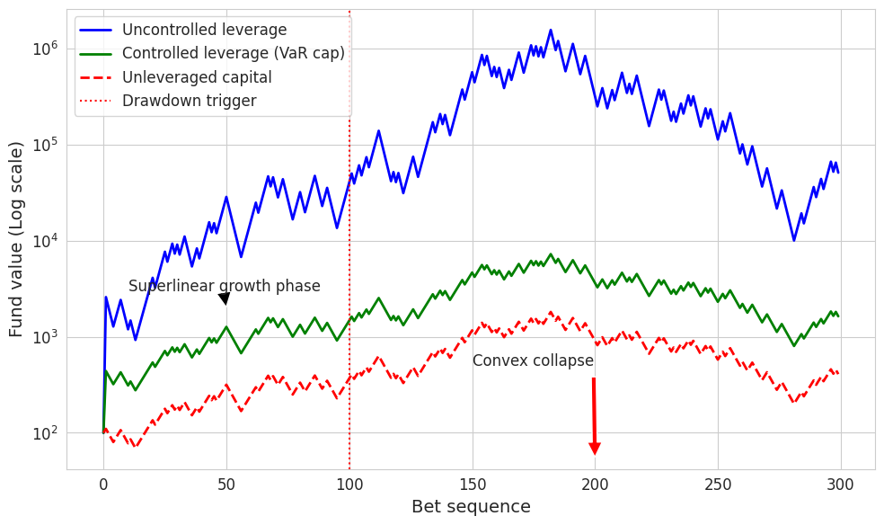
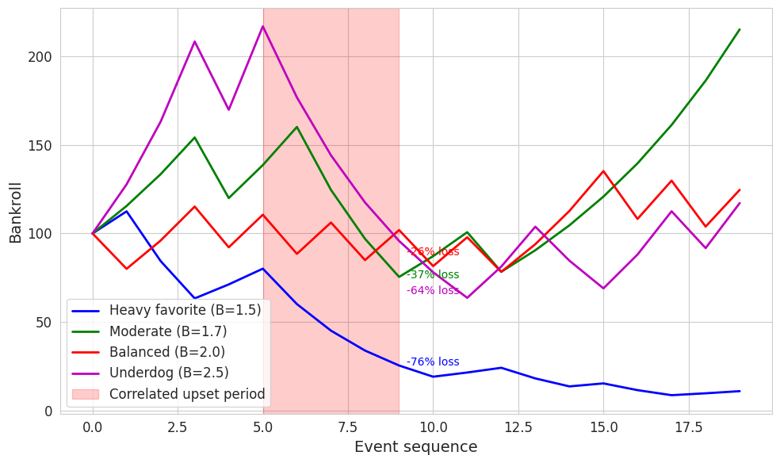
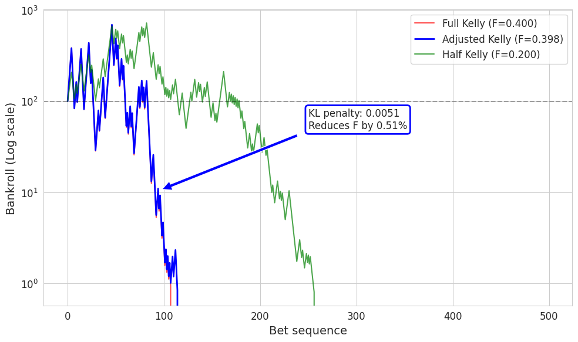
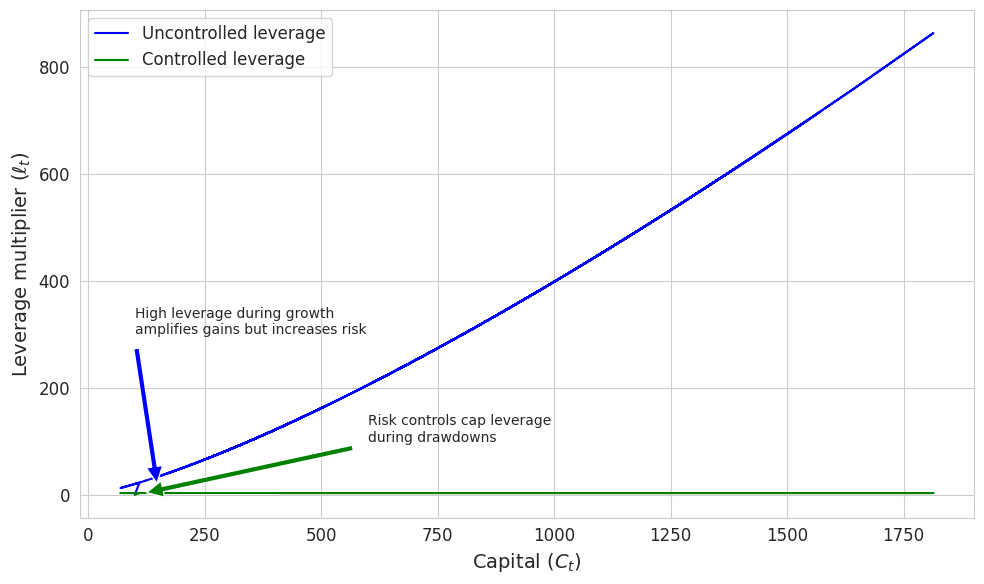
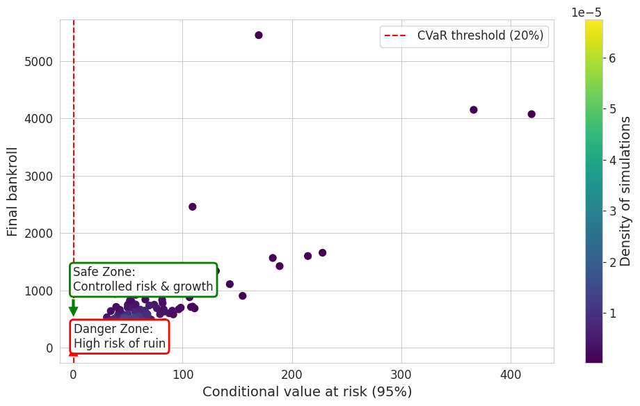

# 📊 Sports Betting Portfolio Simulations

This repository contains Python simulation code accompanying the paper:

**“Towards Sports Betting as a Financial Asset: An Investigative Analysis of Risk, Investment Potential, and Future Perspectives”**  
by René Manassé Galekwa, Jean Marie Tshimula, Etienne Gael Tajeuna, and Kyandoghere Kyamakya.

---

## 🚀 Overview

This project models key financial risk and optimization concepts in the context of sports betting:

- ✅ Leverage cycle dynamics
- ✅ Kelly criterion under uncertainty
- ✅ Correlated stress test simulations
- ✅ Tail risk and CVaR management
- ✅ Multi-panel visual analytics

---

## 📂 Structure

| File | Description |
|------|-------------|
| `simulation.py` | Main simulation script |
| `leverage.png` | Leverage amplification and collapse dynamics |
| `porfolio-test-stress.png` | Portfolio stress test: Simultaneous underdog wins |
| `bankroll-evolution.png` | Bankroll evolution under probability misestimation |
| `leverage-as-function.png` | Leverage as a function of capital |
| `cvaR-vs-final-bankroll.png` | CVaR vs. Final bankroll |
| `README.md` | This file |

---

## 📈 Key Simulations

### 1. Leverage Cycles  
Modeling capital amplification and collapse using recursive leverage functions with/without VaR caps.

### 2. Kelly Criterion under Uncertainty  
Adjusting optimal bet sizing when win probabilities are misestimated (via KL divergence penalty).

### 3. Stress Test Scenario  
Simulating simultaneous underdog wins and measuring impact on various bet types and risk controls.

### 4. CVaR Protection  
Estimating Conditional Value at Risk (CVaR) over 500 portfolio simulations and analyzing safe vs. danger zones.

---

## 🖼️ Leverage amplification and collapse dynamics 



## 🖼️ Portfolio stress test: Simultaneous underdog wins



## 🖼️ Bankroll evolution under probability misestimation



## 🖼️ Leverage as a function of capital



## 🖼️ CVaR vs. Final bankroll



---

## 📦 Dependencies

This project uses:

```bash
numpy
matplotlib
seaborn
scipy
